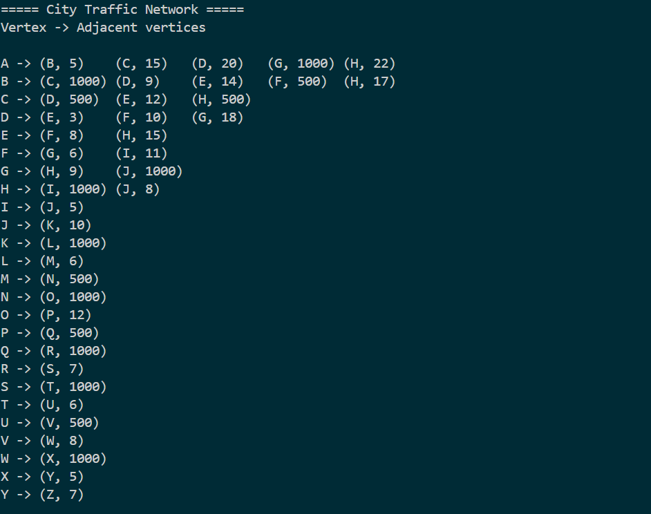
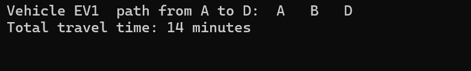
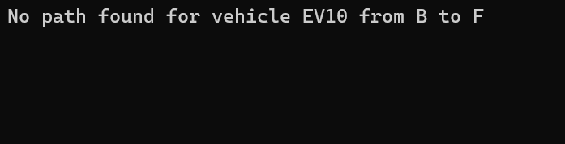
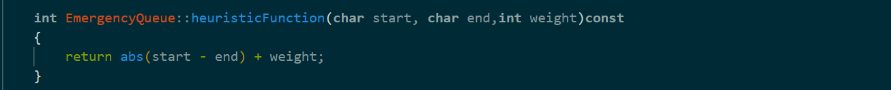

# Smart Traffic Management System Simulator

## Overview
The Smart Traffic Management System Simulator prioritizes vehicle routing based on congestion levels, signal timings, and paths from source to destination. It uses various data structures and algorithms to achieve efficient traffic management.

## Data Structures
- **Graph**: Represents the road network.
- **Priority Queue**: Used for routing emergency vehicles.
- **Hash Map**: Stores congestion levels.
- **Queue**: Facilitates A* pathfinding.
- **Min Heap**: Supports Dijkstra's Algorithm.

## Algorithms
- **A***: Finds the best and shortest path for emergency vehicles.
- **Dijkstra's Algorithm**: Determines the best path for normal vehicles.

---

## Road Network Representation
### Types of Roads:
- **Clear Road**: Weight is as defined in `road_network.csv`.
- **Road in Repair**: Weight is 500.
- **Blocked Road**: Weight is 1000.

### Road Network Display

---

## Priority Queue
### Emergency Vehicle Prioritization:
When executing emergency vehicle routing, a priority queue is implemented using data from `emergency_vehicles.csv`. Vehicles are categorized into:
- **High Priority**: Priority level is 30.
- **Medium Priority**: Priority level is 15.
- **Low Priority**: Priority level is 0.

**Algorithm Used**: A* algorithm determines the path from source to destination. If no valid path exists, it indicates that all possible paths have been explored.

#### Examples:
- **Path Found:**  
  

- **Path Not Found:**  
  

---

## A* Algorithm
### Workflow:
1. **Initial Setup**:
   - Create fixed-size data structures (size = 27 for nodes A-Z):
     - `closedList`: Tracks visited nodes.
     - `gCost`: Stores the shortest path cost from start to each node.
     - `fCost`: Estimated total cost (`gCost + heuristic`).
     - `parent`: Tracks parent nodes for path reconstruction.
     - `openList`: Priority queue sorted by `fCost` values.

2. **Initialization**:
   - Set `gCost[start] = 0`.
   - Compute `fCost[start] = gCost[start] + heuristic(start, goal)`.
   - Add the start node to `openList`.

3. **Main Loop**:
   - Iterate until the goal node is reached or `openList` is empty.

4. **Iteration Steps**:
   - Select node with the lowest `fCost` from `openList`.
   - Check if the goal is reached.
   - For each neighbor:
     - Ignore visited nodes or invalid edges (weights of 500 or 1000).
     - Compute `tentativeGCost = gCost[current] + edgeWeight`.
     - Update if `tentativeGCost` is smaller:
       - Update `gCost` and `fCost`.
       - Record the parent node.
       - Add neighbor to `openList`.

5. **Termination**:
   - **Path Found**: Reconstruct path using the `parent` array and display the total cost.
   - **No Path Found**: Indicate no valid path exists.

6. **Path Reconstruction**:
   - Backtrack from the goal node using `parent` array.
   - Reverse the path array to display the correct order (start → goal).

### Key Points:
- **Heuristic Function**: Estimates the cost to the goal and must be admissible.
  
- **Queue (openList)**: Ensures nodes with the lowest `fCost` are explored first.
- **Early Goal Check**: Stops when the goal is reached, improving efficiency.
- **Advantages**:
  - Faster than Dijkstra's for goal-oriented searches.
  - Customizable heuristics.
- **Disadvantages**:
  - Memory-intensive.
  - Cannot handle graphs with negative weights or cycles.

---

## Emergency Queue Class
This class simulates emergency vehicle routing using priority queues, the A* algorithm, heuristic functions, and path displays. 

### Key Methods:
- **`insertInEmergencyQueue`**: Inserts vehicles into the priority queue.
- **`insertAtEndInEmergencyQueue`**: Inserts vehicles into a simple queue.
- **`readFromEmergencyCsv`**: Reads emergency vehicle data.
- **Basic Queue Operations**: Includes methods like `isEmpty` and `removeFromQueue`.

---

## Graph Class
### Dijkstra's Algorithm Implementation:
Efficiently calculates the shortest path using a Min Heap.

#### Key Components:
1. **Min Heap**:
   - Ensures optimal performance with the following operations:
     - `Heapify`: Maintains the heap property.
     - `Insert`: Adds new nodes.
     - `Extract Min`: Retrieves the node with the smallest distance.

   - **Structure**:
     - Each node is represented as a `HeapQueueNode` containing:
       - `distance`: Calculated distance to the vertex.
       - `vertex`: Vertex identifier.

2. **Graph Representation**:
   - Adjacency lists where each vertex maintains a list of adjacent vertices and weights.

#### Functionality:
- **Initialization**:
  - Initialize a Min Heap.
  - Create arrays for distances, previous nodes, and visited nodes.
  - Set `distance[start] = 0` and add the start vertex to the Min Heap.

- **Processing Vertices**:
  - Extract the vertex with the smallest distance.
  - Skip if already visited.
  - For each unvisited adjacent vertex:
    - Calculate new distance = current distance + edge weight + signal timing.
    - Update if the new distance is smaller.

- **Termination**:
  - Stops when the destination vertex is reached or the Min Heap is empty.

- **Output**:
  - Constructs the shortest path if a valid path exists.
  - Displays "Path not found" if no valid path exists.

#### Code Highlights:
- **Min Heap Operations**:
  - `Heapify`, `Insert`, and `Extract Min` ensure efficiency.
- **Dijkstra's Integration**:
  - Prioritizes vertices based on distances.
  - Includes signal timings in calculations.

### Usage:
- **Vehicle Routing Problems**: Optimizes paths with traffic signal timings.
- **Dynamic Graphs**: Adapts to real-time changes.
- **Large-Scale Graphs**: Efficiently handles complex networks.

### Example Scenario:
For a graph with vertices A, B, C, etc., and weighted edges, the algorithm calculates the shortest path while considering delays like traffic signals. The Min Heap ensures optimal performance.

##Congestion Monitoring HashMap
The Congestion Monitoring HashMap efficiently manages road congestion data using a hash table. It stores roads (identified by two intersections) and the number of vehicles traveling on them, allowing quick access and updates.

###Key Features:
 - Efficient Storage: Uses a hash table for fast lookups, insertions, and deletions.
 - Congestion Tracking: Monitors roads’ congestion based on vehicle count.
 - Real-time Updates: Allows updating congestion levels as traffic changes.
###Key Methods:
 - insert(char intersection1, char intersection2, int carsOnRoad): Adds a road with its vehicle count.
 - remove(char intersection1, char intersection2): Removes a road.
 - getNumOfCars(char intersection1, char intersection2): Retrieves the vehicle count on a road.
 - updateRoad(char intersection1, char intersection2, int carsOnRoad): Updates the vehicle count.
 - displayRoadCongestion(WINDOW *win): Displays congestion data.

###Data Flow:
 - **Input**: Reads traffic data (e.g., from CSV files).
 - **Processing**: Updates congestion as traffic changes.
 - **Output**: Displays real-time congestion status.

##Traffic Signal Management System

This system simulates traffic signal management based on congestion levels and traffic patterns. It dynamically adjusts signal timings to reduce congestion and manage traffic flow efficiently.
The status of the signals is stored in an array which is used as a hashmap

###Key Components:
 - Intersection Class: Represents individual intersections with attributes such as name, green light status, and signal timing.
 - TrafficSignal Class: Manages intersections, traffic signal timings, and congestion updates. It reads traffic signal data from files, adjusts signal timings based on congestion, and updates the status in real-time.
 - Congestion Monitoring: Uses a CongestionHashTable to track the number of cars on each road. Congestion influences signal timings, with signals turning green instantly if congestion exceeds a threshold.

###Key Methods:
 - reduceCongestion(char name, int extraCars, bool turnGreenInstantly): Adjusts signal timing based on congestion.
 - updateTime(Graph &g): Updates the traffic signal timings based on current congestion and road network.
 - updateCongestion(int numOfRoads): Randomly adjusts vehicle counts on roads and updates congestion.
 - displayTraffic(WINDOW *win, int &line, int col): Displays current road congestion status.
 - displaySignals(WINDOW *win, int &line, int col, bool refreshWindow): Displays the current state of traffic signals.
 - getRedTimeLeft(char intersectionName): Returns the remaining red light time for a given intersection.

###Features:
 - Dynamic Traffic Signals: Adjusts signal timings based on real-time congestion data.
 - Congestion Reduction: Instantly turns signals green if congestion exceeds a threshold.
 - Real-time Updates: Simulates changing traffic conditions and updates signal timings accordingly.
